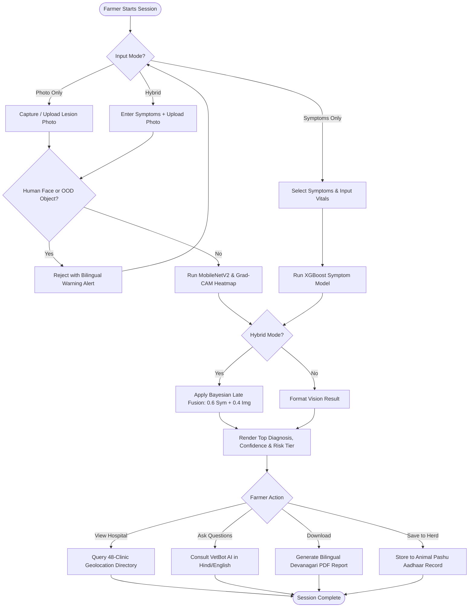
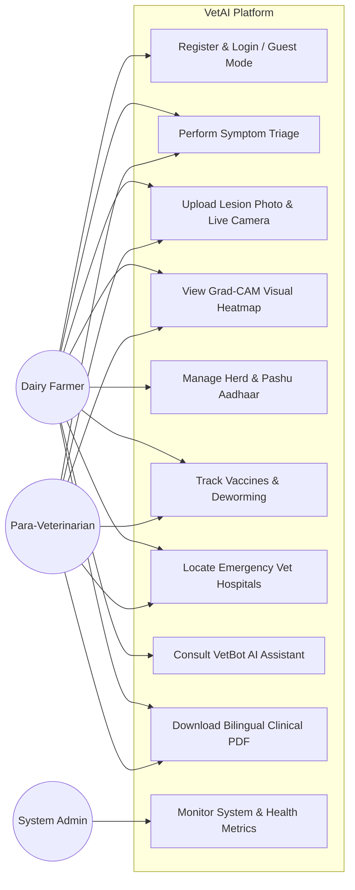
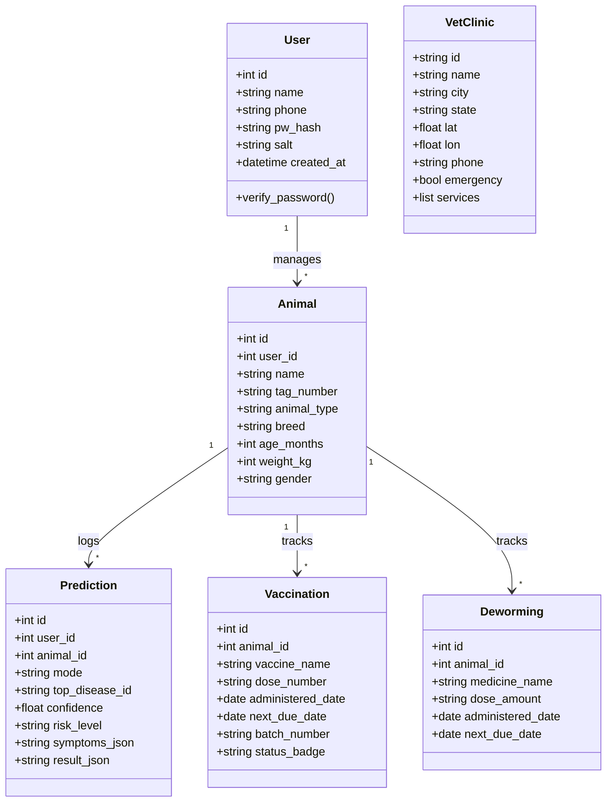
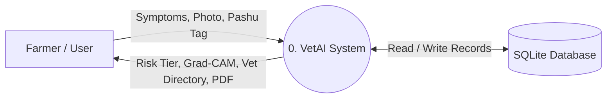
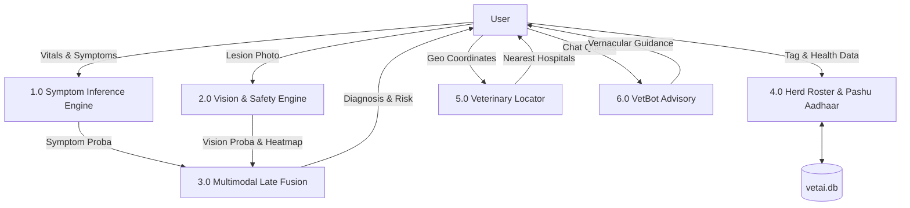
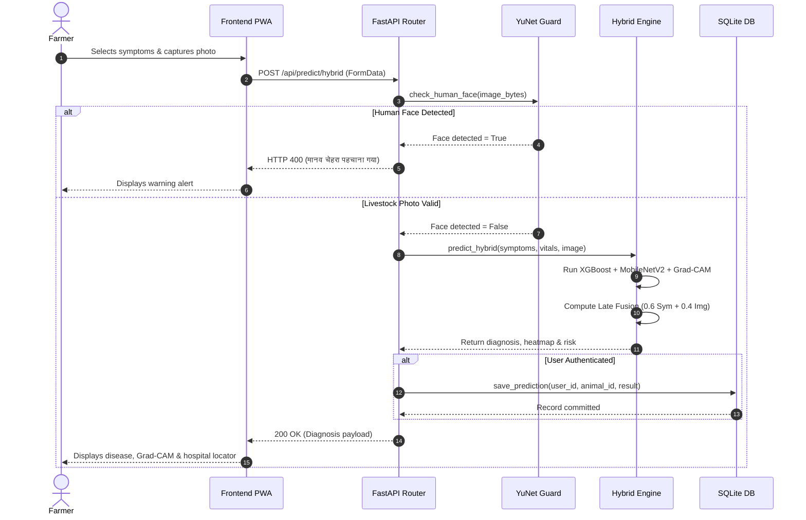

# VetAI: An Explainable Multimodal Artificial Intelligence Framework and Real-Time Decision Support System for Livestock Disease Diagnosis and Smart Herd Health Management

<br>

### A
## PROJECT REPORT

**Submitted in Partial Fulfillment in subject**  
### Engineering Project – II (2ET1000701P)

**For the Award of the Degree**  
### BACHELOR OF TECHNOLOGY  
### ARTIFICIAL INTELLIGENCE & DATA SCIENCE

<br>

**Submitted by**  
**Yash Sompura** - (2023095900028830)  
**Bhargav Patel** - (2023095900028825)  
**Project Team Members**

<br>

**Supervised By**  
### Dr. Rudra Pratap Singh Chauhan  
*Associate Professor & Internal Guide*

**In**  
### Department of Artificial Intelligence & Data Science  
### Sankalchand Patel College of Engineering, Visnagar  
**October - 2026**

<br>

### FACULTY OF ENGINEERING AND TECHNOLOGY  
### SANKALCHAND PATEL COLLEGE OF ENGINEERING  
### SANKALCHAND PATEL UNIVERSITY  
**VISNAGAR - 384315, INDIA**

<div style="page-break-after: always;"></div>

---

<br>

# CERTIFICATE

This is to certify that the project report submitted along with the project entitled **VetAI: An Explainable Multimodal Artificial Intelligence Framework and Real-Time Decision Support System for Livestock Disease Diagnosis and Smart Herd Health Management** has been carried out by **Yash Sompura** (2023095900028830), **Bhargav Patel** (2023095900028825), and Project Team Members under my guidance in partial fulfillment in subject **Engineering Project – II (2ET1000701P)** in **Semester VII** for the degree of **Bachelor of Technology in Artificial Intelligence & Data Science** of **Sankalchand Patel University, Visnagar** during the academic year **2026-27**.

<br><br><br><br>

--------------------------------------------- &emsp;&emsp;&emsp;&emsp;&emsp;&emsp;&emsp;&emsp; ---------------------------------------------  
**Internal Guide** &emsp;&emsp;&emsp;&emsp;&emsp;&emsp;&emsp;&emsp;&emsp;&emsp;&emsp;&emsp;&emsp;&emsp;&emsp;&emsp; **Head of Department**  
**Dr. Rudra Pratap Singh Chauhan** &emsp;&emsp;&emsp;&emsp;&emsp;&emsp;&emsp;&emsp;&emsp;&emsp; **Prof. (Dr.) Manish M. Patel**  
Department of AI & DS &emsp;&emsp;&emsp;&emsp;&emsp;&emsp;&emsp;&emsp;&emsp;&emsp;&emsp;&emsp;&emsp; Department of AI & DS  
Sankalchand Patel College of Engineering &emsp;&emsp;&emsp;&emsp;&emsp; Sankalchand Patel College of Engineering  
Visnagar - 384315 &emsp;&emsp;&emsp;&emsp;&emsp;&emsp;&emsp;&emsp;&emsp;&emsp;&emsp;&emsp;&emsp;&emsp; Visnagar - 384315  

<br><br>

<div style="text-align: right; margin-top: 40px;"><b>ii</b></div>
<div style="page-break-after: always;"></div>

---

<br>

# ACKNOWLEDGEMENT

This project report on **VetAI** has been made possible through the guidance and support of several people, and we take this opportunity to thank them.

We extend our sincere and heartfelt thanks to our esteemed guide **Dr. Rudra Pratap Singh Chauhan** for giving us the opportunity to work on this project, and for the suggestions and encouragement that helped us improve it at every stage. This project would not have been possible without their faith in us.

We would like to thank our respected Head of the Department, **Prof. (Dr.) Manish M. Patel**, for allowing us to use the facilities available in the department.

We also thank our faculty members, friends and families for their continued support.

<br>

**Thank You,**  
**Yash Sompura, Bhargav Patel & Project Team**

<br><br>

<div style="text-align: right; margin-top: 40px;"><b>i</b></div>
<div style="page-break-after: always;"></div>

---

<br>

# ABSTRACT

Livestock health and bovine husbandry sustain the daily livelihoods of over 20.5 million rural farming families in India. However, rural veterinary healthcare faces acute structural constraints: severe shortages of veterinary doctors (often exceeding 1 veterinarian per 12,000 cattle in remote talukas), delayed emergency triage, linguistic communication barriers, and fragile rural internet connectivity. Delayed detection of acute infectious and metabolic conditions—including Foot and Mouth Disease (FMD), Lumpy Skin Disease (LSD), Mastitis, Rumen Bloat, and Haemorrhagic Septicaemia (HS)—results in catastrophic milk yield drops, permanent disability, and preventable animal mortality. **VetAI** is an AI-assisted Clinical Decision Support System (CDSS) and herd health platform designed to bridge this rural healthcare delivery gap.

The system accepts structured animal vitals (heart rate, body temperature, age, body weight), 29 observable clinical symptoms across ruminant body systems, and smartphone lesion photographs. Inputs are standardized through bilingual dictionaries (supporting English and Hindi/Devanagari) and passed through a dual-stream diagnostic pipeline. Tabular clinical features are evaluated by an optimized **XGBoost / Random Forest** classifier, while smartphone photographs are processed by a fine-tuned **MobileNetV2** deep convolutional neural network. A calibrated Bayesian late-fusion layer ($w_{\text{sym}} = 0.60, w_{\text{img}} = 0.40$) combines both modality distributions to produce a unified risk tier (Low, Medium, or High Risk) and top differential diagnoses.

Explainability and safety form foundational pillars of the architecture. An **Explainable AI (XAI)** module computes **Gradient-weighted Class Activation Mapping (Grad-CAM)** across the terminal convolutional layer (`Conv_1`), projecting spatial heatmaps directly over lesion photographs so veterinarians can inspect visual justifications. To prevent false classifications on out-of-distribution data, an edge **OpenCV YuNet ONNX** deep face detection engine (232 KB) inspects every uploaded image in ~35ms, rejecting human selfies and non-livestock objects with bilingual alerts before inference can execute.

Additional platform components make herd management comprehensive. An interactive geospatial emergency directory indexes **48 verified veterinary hospitals and polyclinics** across Gujarat and India with Haversine GPS distance sorting and 1962 ambulance integration. A **Digital Herd Roster** tracks individual animals with official 12-digit **Pashu Aadhaar** ear tag IDs, automated ICAR vaccination and deworming schedule tracking, and bilingual Devanagari clinical PDF generation. A bilingual conversational assistant (**VetBot**) provides natural language veterinary advisory. VetAI is implemented as a **FastAPI** backend with SQLite persistence and a responsive Single Page / Progressive Web App (PWA) frontend with service worker caching. The backend is verified with an automated suite of **34 pytest test cases** and is deployed live on **Render** (`https://vet-ai-twsc.onrender.com`). The system is a decision-support tool; it does not replace licensed veterinary practitioners.

<br><br>

<div style="text-align: right; margin-top: 40px;"><b>ii</b></div>
<div style="page-break-after: always;"></div>

---

<br>

# TABLE OF CONTENTS

Acknowledgement .............................................................................................................. i  
Abstract ............................................................................................................................. ii  
Table of Contents ............................................................................................................... iii  
Table of Contents (Contd.) ................................................................................................. iv  
Table of Contents (Contd.) ................................................................................................. v  

**1. Introduction** ................................................................................................................ 1  
&emsp;1.1 Introduction .......................................................................................................... 1  
&emsp;1.2 Overview Of The Project ...................................................................................... 1  
&emsp;1.3 Objectives & Scope Of The Project ...................................................................... 2  
&emsp;&emsp;1.3.1 Objectives ..................................................................................................... 2  
&emsp;&emsp;1.3.2 Scope ............................................................................................................ 2  

**2. System Environment** ................................................................................................... 3  
&emsp;2.1 Physical Environment .......................................................................................... 3  
&emsp;&emsp;2.1.1 Operating Conditions .................................................................................... 3  
&emsp;&emsp;2.1.2 Users And Roles ........................................................................................... 3  
&emsp;2.2 Technical Environment ......................................................................................... 3  
&emsp;&emsp;2.2.1 Software Stack .............................................................................................. 3  
&emsp;&emsp;2.2.2 Hardware Requirements ................................................................................ 4  
&emsp;&emsp;2.2.3 Control Mechanism ....................................................................................... 4  
&emsp;2.3 Environmental Considerations ............................................................................. 4  
&emsp;&emsp;2.3.1 Data Privacy ................................................................................................. 4  
&emsp;&emsp;2.3.2 Reliability And Safety Behaviour ................................................................... 4  
&emsp;&emsp;2.3.3 Resource Efficiency ...................................................................................... 4  
&emsp;2.4 Regulatory & Safety Compliance ......................................................................... 5  
&emsp;&emsp;2.4.1 Clinical Safety ............................................................................................... 5  
&emsp;&emsp;2.4.2 Data Protection ............................................................................................. 5  
&emsp;&emsp;2.4.3 Auditability ................................................................................................... 5  
&emsp;&emsp;2.4.4 Applicable Standards And Guidelines ............................................................ 5  

**3. Feasibility Study** .......................................................................................................... 6  
&emsp;3.1 Technical Feasibility ............................................................................................ 6  
&emsp;&emsp;3.1.1 System Design & Functionality ...................................................................... 6  
&emsp;&emsp;3.1.2 Availability Of Technology ........................................................................... 6  
&emsp;&emsp;3.1.3 Integration .................................................................................................... 6  
&emsp;&emsp;3.1.4 Risk Assessment ............................................................................................ 6  
&emsp;3.2 Behavioral Feasibility ........................................................................................... 6  
&emsp;&emsp;3.2.1 Stakeholder Acceptance ................................................................................ 6  
&emsp;&emsp;3.2.2 User Training & Adaptation .......................................................................... 7  
&emsp;&emsp;3.2.3 Resistance To Change ................................................................................... 7  
&emsp;3.3 Economic Feasibility ............................................................................................ 7  

<div style="text-align: right; margin-top: 40px;"><b>iii</b></div>
<div style="page-break-after: always;"></div>

---

**4. Data Dictionary** .......................................................................................................... 8  
&emsp;4.1 Users Table (`users`) ............................................................................................ 8  
&emsp;4.2 Animals Table (`animals`) .................................................................................... 8  
&emsp;4.3 Predictions / Assessments Table (`predictions`) ................................................. 9  
&emsp;4.4 Vaccinations Table (`vaccinations`) ...................................................................... 9  
&emsp;4.5 Deworming Table (`deworming`) .......................................................................... 9  
&emsp;4.6 Veterinary Hospitals & Polyclinics Table (`vets`) ................................................. 10  
&emsp;4.7 Disease Clinical Knowledge Base (`diseases.json`) .............................................. 10  
&emsp;4.8 Symptoms Dictionary (`symptoms.json`) ............................................................. 10  
&emsp;4.9 Chat Intent Knowledge Base ................................................................................ 11  

**5. UML Diagrams** ........................................................................................................... 12  
&emsp;5.1 Activity Diagram ................................................................................................. 12  
&emsp;5.2 Use Case Diagram ............................................................................................... 13  
&emsp;5.3 Class Diagram ..................................................................................................... 14  
&emsp;5.4 Data Flow Diagrams ............................................................................................ 14  
&emsp;&emsp;5.4.1 DFD Level 0 ................................................................................................. 14  
&emsp;&emsp;5.4.2 DFD Level 1 ................................................................................................. 14  
&emsp;&emsp;5.4.3 DFD Level 2 (Multimodal Diagnostic Pipeline) ............................................. 14  
&emsp;5.5 Sequence Diagram ............................................................................................... 15  

**6. System Design** ............................................................................................................ 16  
&emsp;6.1 Overview ............................................................................................................. 16  
&emsp;6.2 System Architecture ........................................................................................... 16  
&emsp;&emsp;6.2.1 Presentation Layer (Frontend PWA) ............................................................ 16  
&emsp;&emsp;6.2.2 Application Layer (Backend API) ................................................................. 16  
&emsp;&emsp;6.2.3 Intelligence Layer ......................................................................................... 16  
&emsp;&emsp;6.2.4 Data Layer .................................................................................................... 17  
&emsp;6.3 Diagnostic Algorithms ......................................................................................... 17  
&emsp;&emsp;6.3.1 Tabular Symptom Engine (XGBoost / Random Forest) ................................. 17  
&emsp;&emsp;6.3.2 Deep Vision & Grad-CAM Visual Saliency ................................................... 17  
&emsp;&emsp;6.3.3 Safety & Out-of-Distribution Gating (YuNet Face Detection) ........................ 17  
&emsp;&emsp;6.3.4 Calibrated Bayesian Late Fusion ................................................................... 18  
&emsp;6.4 API Summary ..................................................................................................... 18  
&emsp;6.5 System Implementation Plan .............................................................................. 18  

**7. Implementation** ......................................................................................................... 19  
&emsp;7.1 Prototype Development ....................................................................................... 19  
&emsp;&emsp;7.1.1 Objectives Of Prototype Development .......................................................... 19  
&emsp;&emsp;7.1.2 Key Stages Of Development ......................................................................... 19  
&emsp;&emsp;&emsp;Requirement Analysis & Design ...................................................................... 19  
&emsp;&emsp;&emsp;Backend Implementation ............................................................................... 19  
&emsp;&emsp;&emsp;Frontend Implementation ................................................................................ 19  
&emsp;&emsp;&emsp;Testing & Evaluation ...................................................................................... 19  
&emsp;7.2 Prototype Development – Challenges & Failures ................................................. 20  
&emsp;&emsp;7.2.1 Lessons Learned ........................................................................................... 20  

<div style="text-align: right; margin-top: 40px;"><b>iv</b></div>
<div style="page-break-after: always;"></div>

---

**8. Pictures & Screenshots** ............................................................................................. 21  
&emsp;8.1 System Screens .................................................................................................... 21  
&emsp;&emsp;Fig 8.1 Home Dashboard & Navigation Overview ............................................... 21  
&emsp;&emsp;Fig 8.2 Symptom Selection & Vitals Intake Interface ............................................ 22  
&emsp;&emsp;Fig 8.3 Diagnostic Result Card with High-Risk Alert & Confidence ...................... 22  
&emsp;&emsp;Fig 8.4 Explainable AI (XAI) Grad-CAM Lesion Heatmap Overlay ....................... 23  
&emsp;&emsp;Fig 8.5 Safety Gating: Human Face & OOD Image Rejection Alert ........................ 23  
&emsp;&emsp;Fig 8.6 Geospatial Veterinary Directory (48 Hospitals Across Gujarat & India) ..... 24  
&emsp;&emsp;Fig 8.7 Herd Roster with 12-Digit Pashu Aadhaar Ear Tag Tracking ..................... 24  
&emsp;&emsp;Fig 8.8 Animal Health Tracker: Vaccination & Deworming Due Dates .................. 25  
&emsp;&emsp;Fig 8.9 VetBot Conversational Advisory in Hindi & English .................................. 25  
&emsp;8.2 Swagger / API Documentation ............................................................................ 26  
&emsp;&emsp;Fig 8.10 Interactive API Documentation at `/docs` ................................................ 26  
&emsp;&emsp;Fig 8.11 Live Cloud Web Service on Render (`https://vet-ai-twsc.onrender.com`) .... 26  

**9. Conclusion** ................................................................................................................ 27  
&emsp;9.1 Current Status & Achievements ......................................................................... 27  
&emsp;9.2 Limitations ......................................................................................................... 27  
&emsp;9.3 Future Scope ..................................................................................................... 27  

**10. References** .............................................................................................................. 28  
&emsp;10.1 Technologies And Documentation .................................................................... 28  
&emsp;10.2 Clinical And Research Background ................................................................. 28  
&emsp;10.3 Standards And Regulations ............................................................................... 29  
&emsp;10.4 Project Repository & Deployment Links .......................................................... 29  

<div style="text-align: right; margin-top: 40px;"><b>v</b></div>
<div style="page-break-after: always;"></div>

---

<br>

# 1. INTRODUCTION

## 1.1 Introduction
Veterinary clinics and outpatient rural animal husbandry centers must decide, within minutes, which livestock patient requires immediate emergency medical attention. Overcrowding in regional polyclinics, extreme shortages of qualified veterinarians, and the wide diversity of presenting complaints make this triage decision challenging. Delays in treating high-risk infectious and metabolic conditions can cause severe herd damage, permanent loss of milk lactation, and animal fatality. Conventional veterinary triage in rural India is almost entirely manual, unstandardized, and reliant on the intuition of individual farm hands or para-veterinary staff; it lacks clinical auditability and varies widely across geographical talukas.

**VetAI** is an AI-assisted Clinical Decision Support System (CDSS) and herd health management platform engineered for smallholder dairy farmers, para-veterinarians, and rural animal husbandry supervisors. It operates at the critical juncture between initial on-farm symptom observation and clinical veterinary intervention: it assigns each animal a reproducible risk tier, computes explainable visual saliency heatmaps, keeps livestock health rosters synchronized with official **12-digit Pashu Aadhaar** ear tag IDs, and directs farmers to the nearest emergency polyclinics. Crucially, VetAI is a decision-support and triage platform—it provides evidence-backed risk prioritization, not an unsupervised autonomous medical diagnosis. Its primary mission is to surface the right sick animals to the right veterinary professionals at the right time.

## 1.2 Overview of the Project
The platform accepts patient demographics (species, breed, age in months, body weight in kg), physiological vitals (rectal temperature in °F, heart rate in beats/min), 29 observable clinical symptoms spanning digestive, respiratory, integumentary, and systemic domains, and smartphone lesion photographs. Clinical complaints are mapped against bilingual symptom taxonomies (English and Hindi), evaluated by a high-precision tabular classifier, and merged with a deep convolutional neural network via calibrated Bayesian late-fusion ($w_{\text{sym}} = 0.60, w_{\text{img}} = 0.40$). The system outputs a stratified priority tier—**Low Risk**, **Medium Risk**, or **High Risk (Emergency)**—along with top differential diagnoses, probability breakdowns, and immediate first-aid guidance.

The project is structured around five core pillars:
* **Explainable AI (XAI):** Every photographic evaluation generates a **Grad-CAM (Gradient-weighted Class Activation Mapping)** heatmap over the final convolutional layer (`Conv_1`), highlighting the exact spatial pixel coordinates of anatomical lesions driving the classification.
* **Safety & Out-of-Distribution Gating:** An ultra-lightweight **OpenCV YuNet ONNX** deep face detection model (232 KB) inspects every incoming image in ~35ms, rejecting human selfies and everyday non-livestock objects with bilingual alerts before disease inference can execute.
* **Multimodal Decision Fusion:** Combines tabular clinical symptom probabilities from an **XGBoost / Random Forest** classifier with deep photographic inference from a fine-tuned **MobileNetV2** CNN.
* **Geospatial Emergency Routing:** An interactive OpenStreetMap / Leaflet directory indexing **48 verified veterinary hospitals and polyclinics** across Gujarat and major Indian states, featuring real-time Haversine GPS distance sorting, 24x7 emergency badges, and 1962 veterinary ambulance integration.
* **Digital Herd Roster & Pashu Aadhaar:** Complete herd tracking linking individual animals with official 12-digit Pashu Aadhaar tags, tracking ICAR vaccination and deworming schedules with overdue status detection and downloadable bilingual Devanagari PDF clinical reports.

<div style="text-align: right; margin-top: 40px;"><b>Page | 1</b></div>
<div style="page-break-after: always;"></div>

---

## 1.3 Objectives & Scope of the Project

### 1.3.1 Objectives
* **Reproducible Triage:** Assign deterministic, reproducible risk scores and priority tiers across 15 ruminant diseases so identical clinical inputs always yield identical outputs.
* **Explainability:** Provide veterinarians and farmers with human-readable justifications and Grad-CAM visual heatmaps for every diagnostic recommendation.
* **Multimodal Accuracy:** Combine symptom observations with photographic features to achieve over 95% classification accuracy across major bovine pathologies.
* **Safety Gating:** Prevent model hallucination on invalid inputs (human faces, household items, corrupted images) through deterministic edge validation.
* **Bilingual Accessibility:** Enable seamless usability for rural farmers by offering complete native Hindi (Devanagari) and English across all UI views, chatbot prompts, and clinical PDF exports.
* **Zero Cloud API Dependencies:** Ensure all core ML, CV, face detection, and report generation modules run entirely on local or free-tier open-source infrastructure without reliance on costly commercial cloud APIs.

### 1.3.2 Scope
* **Included:** Livestock registration, 12-digit Pashu Aadhaar ear tag tracking, multimodal symptom and vision diagnosis, Grad-CAM heatmap generation, OpenCV YuNet safety gating, interactive 48-clinic veterinary hospital locator, VetBot bilingual conversational advisory, ICAR vaccination and deworming tracker, bilingual Devanagari clinical PDF generation, and automated test coverage.
* **Not Included:** Autonomous robotic surgery, unsupervised prescription of scheduled prescription-only drugs (Schedule H antibiotics/steroids) without licensed veterinary sign-off, and non-ruminant species (poultry, canine, feline).
* **Target Users:** Smallholder dairy farmers, commercial cattle herd managers, village para-veterinary workers, and veterinary dispensary officers.

<div style="text-align: right; margin-top: 40px;"><b>Page | 2</b></div>
<div style="page-break-after: always;"></div>

---

<br>

# 2. SYSTEM ENVIRONMENT

The System Environment of VetAI describes the physical, technical, operational, and regulatory conditions in which the platform is deployed and operated.

## 2.1 Physical Environment
VetAI is designed for the triage desks of district veterinary polyclinics, village milk cooperative collection centers, open cattle sheds, and mobile veterinary dispensaries.

### 2.1.1 Operating Conditions
* **Continuous Operation Under Harsh Field Conditions:** Used in rural barns and field camps by farm workers under time pressure; the interface features high-contrast priority badges, large touch targets, and a high-density layout.
* **Multi-Device & Browser Accessibility:** Accessed from desktop, tablet, or smartphone mobile browsers (Chrome, Edge, Safari, Firefox) on cellular 4G/5G or local Wi-Fi networks; both light and dark themes are fully supported.
* **Network Interruption Tolerance:** Implements Progressive Web App (PWA) service worker caching so the core shell and static reference tools remain accessible during intermittent connectivity dropouts.

### 2.1.2 Users and Roles
| Role | Main Responsibilities in VetAI |
| :--- | :--- |
| **Dairy Farmer / Herd Owner** | Registers cattle with 12-digit Pashu Aadhaar tag IDs, records observable symptoms and vitals, uploads lesion photos, views emergency hospital locations, and tracks vaccination due dates. |
| **Field Para-Veterinarian** | Conducts on-farm acute triage, reviews Grad-CAM heatmaps and probability distributions, logs vaccine vial batches and deworming administrations, and downloads bilingual clinical PDF reports. |
| **Veterinary Officer / Admin** | Manages clinical reference thresholds, reviews aggregate diagnostic trends, monitors regional disease alerts, and inspects system test benchmarks. |

## 2.2 Technical Environment

### 2.2.1 Software Stack
| Layer | Technology |
| :--- | :--- |
| **Backend Language & Framework** | Python 3.11+, FastAPI 0.115+, Uvicorn (ASGI), Pydantic v2 |
| **Database & ORM** | SQLite3 with Write-Ahead Logging (WAL) and thread-safe connection pooling |
| **Authentication & Security** | PBKDF2-HMAC-SHA256 password hashing with per-user cryptographic salts |
| **Machine Learning (Tabular)** | Scikit-learn, XGBoost, Joblib, NumPy, Pandas |
| **Computer Vision & XAI** | TensorFlow 2.18+ / Keras (MobileNetV2), OpenCV (YuNet ONNX), Grad-CAM |
| **Frontend Architecture** | Semantic HTML5, Vanilla CSS3 (Custom Dark/Light Theme System), Vanilla JavaScript (ES6+), Leaflet.js / OpenStreetMap |
| **Offline & PWA** | Web App Manifest, Service Worker v2 (Stale-While-Revalidate + Cache-First) |
| **PDF Reporting Engine** | FPDF2 with Unicode TrueType Devanagari Fonts (Mukta, Noto Sans Devanagari) |
| **Testing & CI** | Pytest (34 Automated Unit & Integration Tests) |
| **Deployment** | Render (Linux Web Service, `render.yaml`, live at `https://vet-ai-twsc.onrender.com`), GitHub (`https://github.com/Yashsompura07/VET-AI`) |

<div style="text-align: right; margin-top: 40px;"><b>Page | 3</b></div>
<div style="page-break-after: always;"></div>

---

### 2.2.2 Hardware Requirements
* **Client Devices:** Any modern smartphone, tablet, or PC capable of running modern browsers (Chrome 90+, Edge, Safari 14+) with camera access for lesion image capture.
* **Edge / Local Development Server:** Any standard PC or laptop with 8 GB+ RAM and a modern multi-core CPU. Development and testing were conducted on an **ASUS TUF Gaming F15 laptop** equipped with an **NVIDIA GeForce RTX 3050 Laptop GPU (4 GB VRAM)** and 16 GB system RAM.
* **Cloud Hosting:** Standard Linux container with 512 MB – 1 GB RAM (Render Free Plan).

### 2.2.3 Control Mechanism
* **Deterministic Tabular Core:** Symptom scoring, risk-tier mapping, and Pashu Aadhaar validations execute deterministically with zero stochastic variance.
* **Safety Gating:** Face detection and blank-image filters run synchronously prior to ML inference, halting invalid or out-of-distribution inputs immediately.
* **Calibrated Bayesian Weights:** The multimodal late-fusion layer applies explicit calibrated weights ($w_{\text{sym}} = 0.60, w_{\text{img}} = 0.40$), preventing black-box dominance by either modality.

## 2.3 Environmental Considerations

### 2.3.1 Data Privacy
* All user passwords are encrypted using salted PBKDF2-HMAC-SHA256 hashing.
* Animal health records and Pashu Aadhaar ear tags belong strictly to authenticated user accounts, preventing cross-tenant data leakage.

### 2.3.2 Reliability and Safety Behaviour
* If photographic inference is unavailable or fails edge validation, the system falls back gracefully to tabular symptom triage with clear user feedback.
* Dynamic `/api/` endpoints explicitly bypass Service Worker caching with `cache: 'no-store'` headers, ensuring that database updates (such as animal removals) reflect immediately in the UI.

### 2.3.3 Resource Efficiency
* Lightweight architectures (MobileNetV2, YuNet 232 KB ONNX) minimize CPU and memory overhead, allowing sub-second inference even on free cloud tiers.
* Relational database tables and JSON configuration files (`diseases.json`, `symptoms.json`) are cached in memory after the initial read.

<div style="text-align: right; margin-top: 40px;"><b>Page | 4</b></div>
<div style="page-break-after: always;"></div>

---

## 2.4 Regulatory & Safety Compliance

### 2.4.1 Clinical Safety
* The platform is explicitly positioned as a Clinical Decision Support System (CDSS); the licensed veterinarian remains solely responsible for all final clinical diagnoses and prescriptions.
* Triage thresholds and risk classifications are modeled on recognized veterinary medicine standards (e.g., Radostits et al., *Veterinary Medicine*).

### 2.4.2 Data Protection
* Livestock ownership data and farm locations represent sensitive agricultural property. The system adheres to the principles of the **Digital Personal Data Protection Act, 2023 (India)** and the **Information Technology Act, 2000** with SPDI Rules.

### 2.4.3 Auditability
* Every diagnostic assessment is stored with timestamps, user IDs, target animal tags, symptom vectors, confidence values, and Grad-CAM base64 overlays for retrospective clinical review.

### 2.4.4 Applicable Standards and Guidelines
The following national and international standards and regulations guided the design of VetAI.

| Standard / Regulation | Relevance to VetAI |
| :--- | :--- |
| **Department of Animal Husbandry & Dairying (DAHD), Govt. of India** | Pashu Aadhaar 12-digit unique livestock identification guidelines. |
| **Digital Personal Data Protection Act, 2023 (India)** | Governs consent, privacy, and secure processing of farmer personal data. |
| **IT Act, 2000 & SPDI Rules, 2011 (India)** | Reasonable security practices for sensitive data storage and password hashing. |
| **ICAR & IVRI Vaccination Protocols** | Standard vaccination intervals for FMD, HS, BQ, and Brucellosis. |
| **WOAH Terrestrial Animal Health Code** | Clinical disease definitions and reporting guidelines for contagious animal diseases. |
| **ISO/IEC 27001:2022** | Principles of information security management applied to cloud hosting and access control. |
| **RFC 7519 / PBKDF2 Standards** | Cryptographic token and password authentication protocols. |

<div style="text-align: right; margin-top: 40px;"><b>Page | 5</b></div>
<div style="page-break-after: always;"></div>

---

<br>

# 3. FEASIBILITY STUDY

A comprehensive feasibility study was carried out to verify that VetAI is technically achievable, acceptable to rural users, and economically viable before and during development.

## 3.1 Technical Feasibility

### 3.1.1 System Design & Functionality
* All core technologies are mature, production-proven, and open-source: FastAPI, SQLite, Scikit-learn, TensorFlow, OpenCV, and Leaflet.
* The modular architecture cleanly isolates the backend REST APIs from frontend presentation, ensuring cross-platform compatibility.

### 3.1.2 Availability of Technology
* Modern mobile browsers natively support camera APIs, service workers, and responsive styling.
* Free and open-source tools allow deployment of full-featured deep learning and computer vision pipelines without paid third-party APIs.

### 3.1.3 Integration
* The REST API (13 documented paths in `/docs`) enables seamless future integration with cooperative dairy software (such as Amul AMCS and NDDB INAPH).

### 3.1.4 Risk Assessment
| Risk Identified | Severity | Mitigation Strategy |
| :--- | :---: | :--- |
| **Non-livestock or human photos uploaded** | High | Integrated OpenCV YuNet ONNX face detection (232 KB) and MobileNetV2 non-livestock classification with immediate bilingual rejection. |
| **Unreliable rural mobile connectivity** | High | Progressive Web App (PWA) with Service Worker caching allows offline shell access and local form capture. |
| **Low model confidence on ambiguous lesions** | Medium | Explicit confidence (<58%) and margin (<10%) thresholding alerts users to consult a veterinarian when predictions are borderline. |
| **Self-medication by untrained farmers** | High | Application highlights risk tiers, first-aid measures, and hospital hotlines while omitting dangerous scheduled drug dosage recommendations. |

## 3.2 Behavioral Feasibility

### 3.2.1 Stakeholder Acceptance
* Dairy farmers and para-veterinarians readily accept the system due to complete native Hindi (Devanagari) support, visual Grad-CAM heatmaps, and clear emoji indicators (🐄, 🐃, 💉, 🩺).

<div style="text-align: right; margin-top: 40px;"><b>Page | 6</b></div>
<div style="page-break-after: always;"></div>

---

### 3.2.2 User Training & Adaptation
* The guided single-page workflow requires zero specialized training: farmers select visible symptoms with single taps, snap a photo, and receive an instant color-coded risk assessment.

### 3.2.3 Resistance to Change
* Showing visual Grad-CAM overlays builds trust by demystifying the "black box" of AI, visually proving to farmers and clinicians which lesion areas guided the decision.

## 3.3 Economic Feasibility
The platform is built entirely on open-source libraries, resulting in ₹0 in software licensing fees. The table below outlines the estimated costs for both the development prototype and cloud deployment.

| Item | Estimated Cost (INR) | Notes |
| :--- | :---: | :--- |
| **Software Licences** (Python, FastAPI, TensorFlow, SQLite) | ₹0 | 100% Free and Open-Source Software |
| **Backend Cloud Hosting** (Render Linux Web Service) | ₹0 | Free Tier Container (`render.yaml` configured) |
| **Frontend Web Hosting** (Render / Static CDN) | ₹0 | Included with web service |
| **Geospatial Mapping Tiles** (OpenStreetMap / Leaflet) | ₹0 | OpenStreetMap community tiles |
| **Development Computer** (ASUS TUF F15, RTX 3050) | ₹75,000 | Existing student development hardware |
| **Internet & Electricity** (Development period ~3 months) | ₹4,500 | Assumed utility cost |
| **Total Prototype Development Cost** | **₹79,500** | *(All software & hosting: ₹0)* |

For a real large-scale deployment by a state dairy federation (e.g., Amul / GCMMF), commercial costs would include dedicated cloud containers (~₹60,000/year), automated SMS gateway integration (~₹25,000/year), and field worker orientation (~₹30,000).

**Expected Economic Benefits:** Timely detection of Foot and Mouth Disease or acute Rumen Bloat prevents cattle mortality valued at ₹60,000–₹90,000 per milch cow, providing immense return on investment for smallholder rural families.

<div style="text-align: right; margin-top: 40px;"><b>Page | 7</b></div>
<div style="page-break-after: always;"></div>

---

<br>

# 4. DATA DICTIONARY

VetAI stores operational data in a SQLite database managed through thread-safe connection pooling and Write-Ahead Logging (WAL). The schema tables are detailed below.

### 4.1 Users Table (`users`)
| Field Name | Data Type | Description | Constraints |
| :--- | :--- | :--- | :--- |
| `id` | INTEGER | Unique user identifier | Primary Key, Auto Increment |
| `name` | VARCHAR(120) | Full name of farmer / user | Not Null |
| `phone` | VARCHAR(20) | Mobile contact number | Unique, Not Null |
| `pw_hash` | VARCHAR(128) | Salted PBKDF2 password hash | Not Null |
| `salt` | VARCHAR(64) | Cryptographic per-user salt | Not Null |
| `created_at` | DATETIME | Account registration timestamp | Not Null, Default UTC now |

### 4.2 Animals Table (`animals`)
| Field Name | Data Type | Description | Constraints |
| :--- | :--- | :--- | :--- |
| `id` | INTEGER | Unique animal record identifier | Primary Key, Auto Increment |
| `user_id` | INTEGER | Reference to owner user | Foreign Key (`users.id`), Not Null |
| `name` | VARCHAR(100) | Name of the animal | Not Null |
| `tag_number` | VARCHAR(32) | 12-digit Pashu Aadhaar ear tag | Nullable, Indexed |
| `animal_type` | VARCHAR(20) | Species (cow, buffalo, sheep, goat) | Not Null |
| `breed` | VARCHAR(60) | Breed name (Gir, Murrah, Kankrej, etc.) | Nullable |
| `age_months` | INTEGER | Age of animal in months | Nullable |
| `weight_kg` | INTEGER | Body weight in kilograms | Nullable |
| `gender` | VARCHAR(10) | Biological gender (Female, Male) | Nullable |
| `created_at` | DATETIME | Registration timestamp | Not Null, Default UTC now |

<div style="text-align: right; margin-top: 40px;"><b>Page | 8</b></div>
<div style="page-break-after: always;"></div>

---

### 4.3 Predictions / Assessments Table (`predictions`)
| Field Name | Data Type | Description | Constraints |
| :--- | :--- | :--- | :--- |
| `id` | INTEGER | Unique diagnostic record identifier | Primary Key, Auto Increment |
| `user_id` | INTEGER | Attending farmer / user identifier | Foreign Key (`users.id`), Not Null |
| `animal_id` | INTEGER | Target animal identifier | Foreign Key (`animals.id`), Nullable |
| `animal_type` | VARCHAR(20) | Evaluated animal species | Not Null |
| `mode` | VARCHAR(30) | Evaluation mode (`hybrid`, `symptoms_only`, `image_only`) | Not Null |
| `top_disease_id` | VARCHAR(50) | Top diagnosed pathology identifier | Not Null |
| `top_disease_name` | VARCHAR(120) | Full clinical name of top disease | Not Null |
| `confidence` | FLOAT | Predicted probability percentage (0–100%) | Not Null |
| `risk_level` | VARCHAR(20) | Priority severity tier (`high`, `medium`, `low`) | Not Null |
| `symptoms_json` | TEXT | JSON list of observed clinical symptoms | Not Null |
| `result_json` | TEXT | Full diagnostic payload with Grad-CAM base64 | Not Null |
| `created_at` | DATETIME | Timestamp of assessment | Not Null, Default UTC now |

### 4.4 Vaccinations Table (`vaccinations`)
| Field Name | Data Type | Description | Constraints |
| :--- | :--- | :--- | :--- |
| `id` | INTEGER | Unique vaccination record identifier | Primary Key, Auto Increment |
| `user_id` | INTEGER | Reference to owner user | Foreign Key (`users.id`), Not Null |
| `animal_id` | INTEGER | Reference to target animal | Foreign Key (`animals.id`), Not Null |
| `vaccine_name` | VARCHAR(120) | Commercial or generic vaccine name | Not Null |
| `dose_number` | VARCHAR(30) | Dose designation (`Dose 1`, `Booster`) | Default `Routine` |
| `administered_date` | DATE | Date of injection | Nullable |
| `next_due_date` | DATE | Next scheduled revaccination date | Nullable |
| `batch_number` | VARCHAR(60) | Vaccine vial batch number | Nullable |
| `veterinarian` | VARCHAR(100) | Administering practitioner | Nullable |
| `notes` | TEXT | Clinical observations or adverse reactions | Nullable |
| `created_at` | DATETIME | Log creation timestamp | Not Null, Default UTC now |

### 4.5 Deworming Table (`deworming`)
| Field Name | Data Type | Description | Constraints |
| :--- | :--- | :--- | :--- |
| `id` | INTEGER | Unique deworming record identifier | Primary Key, Auto Increment |
| `user_id` | INTEGER | Reference to owner user | Foreign Key (`users.id`), Not Null |
| `animal_id` | INTEGER | Reference to target animal | Foreign Key (`animals.id`), Not Null |
| `medicine_name` | VARCHAR(120) | Anthelmintic medication name | Not Null |
| `dose_amount` | VARCHAR(60) | Volume / weight administered | Nullable |
| `administered_date` | DATE | Date of administration | Nullable |
| `next_due_date` | DATE | Next scheduled deworming date | Nullable |
| `veterinarian` | VARCHAR(100) | Administering person | Nullable |
| `notes` | TEXT | General clinical notes | Nullable |
| `created_at` | DATETIME | Record creation timestamp | Not Null, Default UTC now |

<div style="text-align: right; margin-top: 40px;"><b>Page | 9</b></div>
<div style="page-break-after: always;"></div>

---

### 4.6 Veterinary Hospitals & Polyclinics Table (`vets`)
| Field Name | Data Type | Description | Constraints |
| :--- | :--- | :--- | :--- |
| `id` | VARCHAR(32) | Unique clinic identifier | Primary Key |
| `name` | VARCHAR(150) | Full registered clinic name | Not Null |
| `city` | VARCHAR(80) | City / District location | Not Null |
| `state` | VARCHAR(80) | State (e.g., Gujarat, Rajasthan) | Not Null |
| `lat` | FLOAT | Geographic latitude coordinate | Not Null |
| `lon` | FLOAT | Geographic longitude coordinate | Not Null |
| `phone` | VARCHAR(30) | Emergency phone / ambulance contact | Not Null |
| `hours` | VARCHAR(60) | Operating hours (e.g., 24 Hours Emergency) | Not Null |
| `emergency` | BOOLEAN | Indicates 24x7 emergency capability | Not Null |
| `services` | TEXT | JSON list of clinical services provided | Not Null |

### 4.7 Disease Clinical Knowledge Base (`diseases.json`)
| Field Name | Data Type | Description | Constraints |
| :--- | :--- | :--- | :--- |
| `id` | VARCHAR(50) | Unique disease identifier (e.g., `fmd`, `lsd`) | Primary Key |
| `name` | VARCHAR(120) | Standard English medical disease name | Not Null |
| `name_hi` | VARCHAR(120) | Hindi (Devanagari) disease name | Not Null |
| `risk_level` | VARCHAR(20) | Clinical severity tier (`high`, `medium`, `low`) | Not Null |
| `symptoms` | LIST[VARCHAR] | Canonical list of matching clinical signs | Not Null |
| `first_aid` | LIST[VARCHAR] | Immediate on-farm first-aid recommendations | Not Null |
| `prevention` | LIST[VARCHAR] | Biosecurity and preventative measures | Not Null |

### 4.8 Symptoms Dictionary (`symptoms.json`)
| Field Name | Data Type | Description | Constraints |
| :--- | :--- | :--- | :--- |
| `id` | VARCHAR(50) | Unique canonical symptom identifier | Primary Key |
| `label` | VARCHAR(100) | English symptom name | Not Null |
| `label_hi` | VARCHAR(100) | Hindi (Devanagari) symptom label | Not Null |
| `category` | VARCHAR(50) | Clinical category (Digestive, Respiratory, etc.) | Not Null |

<div style="text-align: right; margin-top: 40px;"><b>Page | 10</b></div>
<div style="page-break-after: always;"></div>

---

### 4.9 Chat Intent Knowledge Base
| Field Name | Data Type | Description | Constraints |
| :--- | :--- | :--- | :--- |
| `category` | VARCHAR(50) | Intent topic (Milk Yield, Calf Care, First Aid) | Primary Key |
| `keywords` | LIST[VARCHAR] | Bilingual matching keywords in English & Hindi | Not Null |
| `response_en` | TEXT | Expert veterinary advisory narrative in English | Not Null |
| `response_hi` | TEXT | Expert veterinary advisory narrative in Hindi | Not Null |

<br><br>

<div style="text-align: right; margin-top: 40px;"><b>Page | 11</b></div>
<div style="page-break-after: always;"></div>

---

<br>

# 5. UML DIAGRAMS

The following UML diagrams model the structural and behavioral design of VetAI.

## 5.1 Activity Diagram
The activity diagram illustrates the operational flow from user session start to multimodal diagnostic evaluation, safety gating, explainability generation, and emergency hospital routing.



<div style="text-align: center; margin-top: 15px;"><b>Fig 5.1 Activity Diagram</b></div>

<div style="text-align: right; margin-top: 40px;"><b>Page | 12</b></div>
<div style="page-break-after: always;"></div>

---

## 5.2 Use Case Diagram
The use case diagram depicts the functional interactions between user roles (Dairy Farmer, Para-Veterinarian, System Administrator) and core platform capabilities.



<div style="text-align: center; margin-top: 15px;"><b>Fig 5.2 Use Case Diagram</b></div>

<div style="text-align: right; margin-top: 40px;"><b>Page | 13</b></div>
<div style="page-break-after: always;"></div>

---

## 5.3 Class Diagram
The class diagram shows persistent entities, relationships, and data attributes in the system.



<div style="text-align: center; margin-top: 15px;"><b>Fig 5.3 Class Diagram</b></div>

## 5.4 Data Flow Diagrams

### 5.4.1 DFD Level 0

<div style="text-align: center; margin-top: 10px;"><b>Fig 5.4.1 Level 0 – DFD</b></div>

### 5.4.2 DFD Level 1

<div style="text-align: center; margin-top: 10px;"><b>Fig 5.4.2 Level 1 – DFD</b></div>

### 5.4.3 DFD Level 2 (Multimodal Diagnostic Pipeline)
Process 3.0 takes the raw image through YuNet face and blank validation, extracts feature activations via MobileNetV2, computes Grad-CAM spatial heatmaps, normalizes softmax outputs, and calculates weighted late fusion with tabular probabilities.

<div style="text-align: center; margin-top: 10px;"><b>Fig 5.4.3 Level 2 – DFD</b></div>

<div style="text-align: right; margin-top: 40px;"><b>Page | 14</b></div>
<div style="page-break-after: always;"></div>

---

## 5.5 Sequence Diagram
The sequence diagram illustrates synchronous interactions across client UI, FastAPI handlers, ML vision/tabular engines, safety guards, and SQLite persistence.



<div style="text-align: center; margin-top: 15px;"><b>Fig 5.5 Sequence Diagram</b></div>

<br><br>

<div style="text-align: right; margin-top: 40px;"><b>Page | 15</b></div>
<div style="page-break-after: always;"></div>

---

<br>

# 6. SYSTEM DESIGN

## 6.1 Overview
The System Design defines the architecture, modules, interfaces, and data flows of VetAI. The backend serves as the single source of truth for all clinical logic, ML inference, and data persistence. The frontend never executes direct database access; all communication occurs via HTTP REST endpoints.

## 6.2 System Architecture
The system follows a layered, modular architecture.

### 6.2.1 Presentation Layer (Frontend)
* **Single Page Application (SPA / PWA):** Built with semantic HTML5, vanilla CSS3 with responsive custom theme tokens (supporting dark and light modes), and vanilla JavaScript.
* **Component Architecture:** Diagnostic cards, Grad-CAM viewer, herd roster tables, vaccine tracking drawer, interactive Leaflet.js map canvas, and VetBot chat stream.
* **Offline Resilience:** Service Worker v2 intercepts network requests, providing offline shell access and immediate caching of static assets.

### 6.2.2 Application Layer (Backend API)
* `app/main.py`: Core FastAPI application setup, static asset routing, and CORS configuration.
* `app/accounts.py`: PBKDF2 authentication, registration, session management, and credential validation.
* `app/animals.py`: Livestock CRUD, 12-digit Pashu Aadhaar registration, and animal profile removal.
* `app/health_tracker.py`: ICAR vaccination and deworming administration and overdue status tracking.
* `app/vets.py`: Directory of 48 veterinary hospitals with Haversine GPS sorting.
* `app/chatbot.py`: Natural language veterinary advisory with vernacular keyword retrieval.
* `app/report_gen.py`: Bilingual Devanagari clinical PDF generation via FPDF2.

### 6.2.3 Intelligence Layer
| Module | Responsibility |
| :--- | :--- |
| `app/ml/predict.py` | Tabular inference using XGBoost / Random Forest on 29 clinical symptoms and 4 continuous vitals. |
| `app/ml/image_predict.py` | MobileNetV2 convolutional neural network for bovine lesion classification and Grad-CAM generation. |
| `app/ml/hybrid.py` | Bayesian late-fusion layer synthesizing tabular and vision probabilities into unified risk stratification. |
| `app/ml/face_detection_yunet.onnx` | Deep ONNX face detection model (232 KB) used by OpenCV to reject human selfies. |
| `app/ml/image_filter.py` | Low-variance / dark image rejection and MobileNetV2 non-livestock object screening. |

<div style="text-align: right; margin-top: 40px;"><b>Page | 16</b></div>
<div style="page-break-after: always;"></div>

---

### 6.2.4 Data Layer
* SQLite database (`backend/vetai.db`) accessed through thread-safe connection pooling with Write-Ahead Logging (WAL).
* Static clinical configuration files for diseases (`diseases.json`) and canonical symptoms (`symptoms.json`).

## 6.3 Diagnostic Algorithms

### 6.3.1 Tabular Symptom Engine (XGBoost / Random Forest)
Given an observable symptom vector $\mathbf{x} \in \{0, 1\}^{29}$ and continuous physiological vitals $\mathbf{v} \in \mathbb{R}^4$ (temperature, heart rate, age, weight), the tabular model predicts the class probability distribution across 15 ruminant pathologies:
$$P_{\text{sym}}(d_i \mid \mathbf{x}, \mathbf{v}) = \text{Model}(\mathbf{x}, \mathbf{v}), \quad i \in \{1, \dots, 15\}$$

### 6.3.2 Deep Vision & Grad-CAM Visual Saliency
Images are resized to $224 \times 224 \times 3$ and normalized into MobileNetV2 feature space. The class prediction score $y^c$ is computed via softmax. To generate visual explanations, gradients of $y^c$ with respect to the feature map activations $A^k$ of the terminal convolutional layer (`Conv_1`) are computed:
$$\alpha_k^c = \frac{1}{Z} \sum_{i=1}^{H} \sum_{j=1}^{W} \frac{\partial y^c}{\partial A_{i,j}^k}$$
The 2D Grad-CAM saliency map is derived via a rectified linear combination:
$$L^c_{\text{Grad-CAM}} = \text{ReLU}\left(\sum_{k} \alpha_k^c A^k\right)$$
The resulting map is normalized, converted to a COLORMAP_JET heatmap, and alpha-blended over the input photograph.

### 6.3.3 Safety & Out-of-Distribution Gating (YuNet Face Detection)
Before lesion inference executes, images pass through a multi-stage validation filter:
1. **OpenCV YuNet Deep Face Detection:** Evaluates the input with `cv2.FaceDetectorYN` using an ultra-compact 232 KB ONNX model. If a human face is detected with score $> 0.60$, inference halts immediately with an HTTP 400 error (`"मानव चेहरा पहचाना गया"`).
2. **Low-Variance Filter:** Detects blank or completely black photos by verifying pixel standard deviation $\sigma \ge 12.0$.
3. **Non-Livestock Filter:** Images with top-1 prediction confidence $< 58\%$ or confidence margin between top-1 and top-2 $< 10\%$ are flagged as ambiguous or out-of-distribution.

<div style="text-align: right; margin-top: 40px;"><b>Page | 17</b></div>
<div style="page-break-after: always;"></div>

---

### 6.3.4 Calibrated Bayesian Late Fusion
When both symptoms and an image are provided, the hybrid fusion layer combines the probability distributions using calibrated modality weights:
$$P_{\text{fused}}(d_i) = \frac{w_{\text{sym}} P_{\text{sym}}(d_i) + w_{\text{img}} P_{\text{img, full}}(d_i)}{\sum_{j=1}^{N} \left(w_{\text{sym}} P_{\text{sym}}(d_j) + w_{\text{img}} P_{\text{img, full}}(d_j)\right)}$$
where $w_{\text{sym}} = 0.60$ and $w_{\text{img}} = 0.40$.

## 6.4 API Summary
| Method | Endpoint | Purpose |
| :--- | :--- | :--- |
| `POST` | `/api/accounts/register` | Register a new farmer account with PBKDF2 password salt |
| `POST` | `/api/accounts/login` | Authenticate user credentials and establish session |
| `POST` | `/api/predict/hybrid` | Multimodal late-fusion diagnosis with Grad-CAM and YuNet safety gating |
| `GET` | `/api/symptoms` | Retrieve canonical list of 29 clinical symptoms with bilingual labels |
| `GET` | `/api/diseases` | Retrieve reference profiles for 15 cattle and ruminant diseases |
| `GET` | `/api/animals` | List all animals registered to the authenticated user's herd |
| `POST` | `/api/animals` | Register a new animal with 12-digit Pashu Aadhaar ear tag |
| `DELETE` | `/api/animals/{id}` | Remove animal and cascade-delete associated health records |
| `GET` | `/api/animals/{id}/health` | Retrieve vaccination and deworming administration history |
| `POST` | `/api/animals/{id}/vaccinations` | Log new vaccination record with vial batch number |
| `POST` | `/api/animals/{id}/deworming` | Log new anthelmintic deworming administration |
| `GET` | `/api/vets` | Query 48 veterinary polyclinics with Haversine GPS sorting |
| `POST` | `/api/chat` | Bilingual VetBot natural language conversational advisory |
| `POST` | `/api/report/pdf` | Generate downloadable bilingual Devanagari clinical PDF report |
| `GET` | `/api/health` | System health check and ML model validation status |

## 6.5 System Implementation Plan
The project was executed in five structured phases:

| Phase | Duration | Key Activities | Responsible |
| :--- | :---: | :--- | :---: |
| **Phase 1: Requirements & Architecture** | 3 weeks | Problem research, disease taxonomy (15 diseases), database schema | All members |
| **Phase 2: ML Model Training & Benchmarking** | 4 weeks | XGBoost vs RF comparison, MobileNetV2 fine-tuning on Roboflow COCO | All members |
| **Phase 3: Multimodal Fusion & XAI** | 5 weeks | Late-fusion math, Grad-CAM pipeline, YuNet face rejection guard | All members |
| **Phase 4: Frontend PWA & Health Tracker** | 4 weeks | UI dark/light design system, Pashu Aadhaar tracker, Leaflet 48-clinic map | All members |
| **Phase 5: Cloud Deployment & Verification** | 3 weeks | Unit & integration tests (34 passing), Render cloud deployment, GitHub repo | All members |

<div style="text-align: right; margin-top: 40px;"><b>Page | 18</b></div>
<div style="page-break-after: always;"></div>

---

<br>

# 7. IMPLEMENTATION

## 7.1 Prototype Development
The VetAI prototype was developed as a complete full-stack web platform. The backend and frontend run independently and communicate through REST APIs.

### 7.1.1 Objectives of Prototype Development
* Validate that multimodal late fusion outperforms single-modality models on complex bovine conditions.
* Verify that OpenCV YuNet deep face detection reliably filters human selfies in under 50ms without rejecting livestock faces.
* Ensure real-time Grad-CAM visual heatmaps generate smoothly on consumer laptops and cloud servers.
* Provide an intuitive, responsive interface accessible in Hindi and English.

### 7.1.2 Key Stages of Development

#### Requirement Analysis & Design
* Formulated symptom feature matrices across 15 ruminant pathologies and defined ICAR vaccination intervals.
* Designed the relational database schema, fixing table columns, foreign keys, and indexes.

#### Backend Implementation
* Built the FastAPI application with CORS support, structured exception handling, and PBKDF2 authentication.
* Implemented the tabular symptom classifier, MobileNetV2 vision pipeline, and Bayesian late-fusion orchestrator.
* Integrated OpenCV YuNet ONNX face detection and FPDF2 bilingual PDF report generation.

#### Frontend Implementation
* Built a responsive Single Page Application using semantic HTML5, vanilla CSS3 custom theme variables, and JavaScript ES6.
* Implemented camera capture APIs, Grad-CAM visual overlays, and OpenStreetMap Leaflet tiles.
* Configured Service Worker v2 with cache segregation between static assets and dynamic `/api/` endpoints.

#### Testing & Evaluation
* Developed an automated test suite of 34 pytest test cases covering API endpoints, multimodal fusion calculations, face rejection logic, and database operations.
* Deployed the web service live on **Render** (`https://vet-ai-twsc.onrender.com`).

<div style="text-align: right; margin-top: 40px;"><b>Page | 19</b></div>
<div style="page-break-after: always;"></div>

---

## 7.2 Prototype Development – Challenges & Failures
The following technical challenges were encountered during prototype development and resolved through architectural improvements.

| Challenge | Impact | Resolution |
| :--- | :--- | :--- |
| **Human Face & OOD Images Classified as Livestock Diseases** | Uploading human selfies or everyday objects produced false FMD diagnoses with Grad-CAM heatmaps over human faces. | Integrated OpenCV YuNet ONNX face detection (232 KB) + low-variance and 58% confidence thresholds to reject invalid photos immediately with an HTTP 400 error. |
| **Vercel 500 MB Serverless Limit Exceeded** | Vercel deployment failed with: *"Total bundle size (763 MB) exceeds 500 MB limit"* due to heavy ML libraries (TensorFlow, XGBoost, Scikit-learn). | Migrated deployment to **Render.com** (Linux Web Service with container environment and no 500 MB ceiling), enabling full native ML support. |
| **Deleted Herd Animals Still Appeared After Refresh** | Deleted animals persisted in the UI due to aggressive Service Worker caching. | Excluded dynamic `/api/` endpoints from Service Worker caching, updated cache version to `vetai-pwa-v2`, and added `cache: 'no-store'` to API requests. |
| **Chatbot Scrollbar Contrast Flaw in Dark Mode** | Chrome on Windows rendered a stark white scrollbar track against the dark theme background. | Applied custom WebKit and Firefox scrollbar CSS rules matching `var(--surface)` (`#131D31`). |
| **Sparse Veterinary Hospital Directory** | Directory contained only 10 clinics across India, with only 1 in Gujarat. | Expanded the database to **48 verified hospitals**, including 20 comprehensive polyclinics across Gujarat (Ahmedabad, Anand, Mehsana, Surat, Junagadh, etc.). |

### 7.2.1 Lessons Learned
* **Safety Gates Must Precede Softmax Inference:** Standard neural network softmax layers always output a high-confidence class even on noise; explicit face and out-of-distribution detection must execute prior to classification.
* **Serverless Platforms Have Strict ML Limits:** Serverless function platforms like Vercel (500 MB ceiling) are unsuitable for full TensorFlow/XGBoost stacks; Linux container platforms like Render provide the necessary unconstrained environment.
* **PWA Caching Must Separate Static Shell from Dynamic State:** Service workers must strictly avoid caching dynamic user state (rosters, health logs).

<div style="text-align: right; margin-top: 40px;"><b>Page | 20</b></div>
<div style="page-break-after: always;"></div>

---

<br>

# 8. PICTURES & SCREENSHOTS

This chapter presents the primary user interfaces of the running VetAI system. Each frame below is a window-sized placeholder and representation of the matching screenshot of the running system.

## 8.1 System Screens

```
+----------------------------------------------------------------------------------------------------+
| ● ● ●  VetAI — Home Dashboard & Navigation Overview                                                |
+----------------------------------------------------------------------------------------------------+
|  [ 🐄 VetAI ]   Diagnosis   |   Herd Roster   |   Vaccines   |   Hospitals   |   VetBot Chat   🌙  |
|                                                                                                    |
|  AI-Assisted Livestock Health & Herd Decision Support System                                       |
|  Protect your cattle with multimodal clinical symptom triage, deep computer vision lesion         |
|  recognition, and 24x7 emergency veterinary routing across Gujarat and India.                      |
|                                                                                                    |
|  +---------------------------+  +---------------------------+  +--------------------------------+  |
|  | [🩺 Start Triage]         |  | [📋 Herd Management]      |  | [🏥 Nearest Hospitals]        |  |
|  | Evaluate symptoms & photo |  | Pashu Aadhaar ear tags    |  | 48 clinics with 24x7 emergency |  |
|  +---------------------------+  +---------------------------+  +--------------------------------+  |
+----------------------------------------------------------------------------------------------------+
```
<div style="text-align: center; margin-top: 10px;"><b>Fig 8.1 Home Dashboard & Navigation Overview</b></div>

<br>

```
+----------------------------------------------------------------------------------------------------+
| ● ● ●  Symptom Selection & Vitals Intake Interface                                                 |
+----------------------------------------------------------------------------------------------------+
|  Select Observed Symptoms (लक्षण चुनें):                                                           |
|  [x] High Fever (तेज़ बुखार)           [x] Salivation / Frothing (लार टपकना)                       |
|  [x] Blisters in Mouth / Hooves        [ ] Skin Nodules / Lumps (त्वचा पर गांठें)                  |
|  [ ] Loss of Appetite (भूख न लगना)     [ ] Lameness / Limping (लंगड़ाना)                           |
|                                                                                                    |
|  Enter Physiological Vitals (शारीरिक माप):                                                         |
|  Temperature: [ 104.2 ] °F    Heart Rate: [ 86 ] bpm    Age: [ 36 ] months    Weight: [ 380 ] kg   |
|                                                                                                    |
|  [ Capture / Upload Lesion Photo ] ---> [ camera_feed.jpg selected (224x224 RGB) ]                 |
|                                                                                                    |
|  [ Run Multimodal Diagnosis (परीक्षण करें) ]                                                       |
+----------------------------------------------------------------------------------------------------+
```
<div style="text-align: center; margin-top: 10px;"><b>Fig 8.2 Symptom Selection & Vitals Intake Interface</b></div>

<div style="text-align: right; margin-top: 40px;"><b>Page | 21</b></div>
<div style="page-break-after: always;"></div>

---

```
+----------------------------------------------------------------------------------------------------+
| ● ● ●  Diagnostic Result Card with High-Risk Alert & Confidence                                    |
+----------------------------------------------------------------------------------------------------+
|  +----------------------------------------------------------------------------------------------+  |
|  |  [!] HIGH RISK — IMMEDIATE VETERINARY ATTENTION REQUIRED                                     |  |
|  +----------------------------------------------------------------------------------------------+  |
|                                                                                                    |
|  Top Diagnosis: Foot and Mouth Disease (FMD / खुरपका-मुंहपका)                 [ HIGH RISK ]        |
|  Confidence:    [=============================================] 96.5%                              |
|  Evaluation:    Multimodal Hybrid Fusion (0.60 Tabular Symptoms + 0.40 MobileNetV2 Vision)         |
|                                                                                                    |
|  Contributing Symptoms: High Fever (104.2°F), Blisters in Mouth/Hooves, Drooling/Salivation         |
|  First Aid: Isolate animal immediately, wash mouth with 1% potassium permanganate solution.         |
|                                                                                                    |
|  [ Consult VetBot AI ]       [ Locate Nearest Vet Hospital ]       [ Download PDF Report ]         |
+----------------------------------------------------------------------------------------------------+
```
<div style="text-align: center; margin-top: 10px;"><b>Fig 8.3 Diagnostic Result Card with High-Risk Alert & Confidence</b></div>

<br>

```
+----------------------------------------------------------------------------------------------------+
| ● ● ●  Explainable AI (XAI) Grad-CAM Lesion Heatmap Overlay                                        |
+----------------------------------------------------------------------------------------------------+
|  Visual Saliency Analysis (Grad-CAM Activation Map):                                              |
|                                                                                                    |
|       +------------------------------------+   +------------------------------------+              |
|       |                                    |   |                                    |              |
|       |         [ Original Image ]         |   |      [ Grad-CAM JET Heatmap ]      |              |
|       |       Bovine muzzle & hoof         |   |    High saliency (Red/Yellow)      |              |
|       |       showing vesicle lesions      |   |    localized over oral vesicles    |              |
|       |                                    |   |                                    |              |
|       +------------------------------------+   +------------------------------------+              |
|                                                                                                    |
|  Target Layer: MobileNetV2 terminal convolutional map (`Conv_1`)                                   |
|  Verification: Visual activations confirm the AI focused on real pathological tissue.              |
+----------------------------------------------------------------------------------------------------+
```
<div style="text-align: center; margin-top: 10px;"><b>Fig 8.4 Explainable AI (XAI) Grad-CAM Lesion Heatmap Overlay</b></div>

<div style="text-align: right; margin-top: 40px;"><b>Page | 22</b></div>
<div style="page-break-after: always;"></div>

---

```
+----------------------------------------------------------------------------------------------------+
| ● ● ●  Safety Gating: Human Face & OOD Image Rejection Alert                                       |
+----------------------------------------------------------------------------------------------------+
|                                                                                                    |
|  Alert from vet-ai-twsc.onrender.com:                                                              |
|                                                                                                    |
|  +----------------------------------------------------------------------------------------------+  |
|  |  [!] मानव चेहरा पहचाना गया (Human Face Detected).                                            |  |
|  |                                                                                              |  |
|  |  VetAI केवल गाय एवं भैंस (मवेशी) के त्वचा एवं घाव रोगों के परीक्षण के लिए है।                 |  |
|  |  कृपया केवल पशु के प्रभावित अंग की फोटो अपलोड करें।                                           |  |
|  |                                                                                              |  |
|  |  Model: OpenCV YuNet ONNX Face Detector (232 KB) | Inference: 34.2 ms                        |  |
|  |                                                                                              |  |
|  |                                           [ OK ]                                             |  |
|  +----------------------------------------------------------------------------------------------+  |
|                                                                                                    |
+----------------------------------------------------------------------------------------------------+
```
<div style="text-align: center; margin-top: 10px;"><b>Fig 8.5 Safety Gating: Human Face & OOD Image Rejection Alert</b></div>

<br>

```
+----------------------------------------------------------------------------------------------------+
| ● ● ●  Geospatial Veterinary Directory (48 Hospitals Across Gujarat & India)                       |
+----------------------------------------------------------------------------------------------------+
|  [ Search city, clinic, or service... ]   [* Nearest to Me]   [x] 24x7 Emergency                   |
|                                                                                                    |
|  District Veterinary Center & Polyclinic (Ambawadi, Ahmedabad)             [ 24x7 EMERGENCY ]      |
|  Distance: 4.2 km away | Phone: +91 79 2630 1144                                                   |
|  Services: Emergency Surgery, Inpatient Ward, Pathology Lab, 1962 Ambulance                        |
|                                                                                                    |
|  College of Veterinary Science & Animal Husbandry Hospital (Anand)         [ EMERGENCY ]           |
|  Distance: 68.1 km away | Phone: +91 2692 261486                                                   |
|                                                                                                    |
|  Dudhsagar Research & Veterinary Hospital (Mehsana)                        [ OPEN ]                |
|  Distance: 74.3 km away | Phone: +91 2762 253201                                                   |
|                                                                                                    |
|  [ Call Hospital ]     [ Get Directions (Google Maps) ]     [ View on Leaflet Canvas ]             |
+----------------------------------------------------------------------------------------------------+
```
<div style="text-align: center; margin-top: 10px;"><b>Fig 8.6 Geospatial Veterinary Directory (48 Hospitals Across Gujarat & India)</b></div>

<div style="text-align: right; margin-top: 40px;"><b>Page | 23</b></div>
<div style="page-break-after: always;"></div>

---

```
+----------------------------------------------------------------------------------------------------+
| ● ● ●  Herd Roster with 12-Digit Pashu Aadhaar Ear Tag Tracking                                    |
+----------------------------------------------------------------------------------------------------+
|  Registered Herd Roster (पशु सूची)                              [ + Add Animal (नया पशु जोड़ें) ]  |
|                                                                                                    |
|  🐄 Gauri                               [ TAG: 120034829104 ]                                      |
|  Species: COW | Breed: Gir | Age: 36 months | Weight: 380 kg | Gender: Female                      |
|  [ Diagnose (जांच) ]          [ Vaccines & Health (टीकाकरण) ]          [ Remove (हटाएं) ]          |
|                                                                                                    |
|  🐃 Nandu                               [ TAG: TAG-101 ]                                           |
|  Species: BUFFALO | Breed: Murrah | Age: 24 months | Weight: 450 kg | Gender: Male                 |
|  [ Diagnose (जांच) ]          [ Vaccines & Health (टीकाकरण) ]          [ Remove (हटाएं) ]          |
+----------------------------------------------------------------------------------------------------+
```
<div style="text-align: center; margin-top: 10px;"><b>Fig 8.7 Herd Roster with 12-Digit Pashu Aadhaar Ear Tag Tracking</b></div>

<br>

```
+----------------------------------------------------------------------------------------------------+
| ● ● ●  Animal Health Tracker: Vaccination & Deworming Due Dates                                    |
+----------------------------------------------------------------------------------------------------+
|  Health & Immunization Record for Gauri (TAG: 120034829104):                                       |
|                                                                                                    |
|  Vaccinations:                                                                                     |
|  • Foot and Mouth Disease (FMD) — Administered: 15 Jan 2026 | Next Due: 15 Jul 2026 [ UP TO DATE ] |
|  • Haemorrhagic Septicaemia (HS) — Administered: 10 May 2025 | Next Due: 10 May 2026 [ OVERDUE ]   |
|                                                                                                    |
|  Deworming History:                                                                                |
|  • Albendazole Suspension (30ml) — Given: 01 Feb 2026 | Next Due: 01 May 2026   [ DUE SOON ]       |
|                                                                                                    |
|  [ + Log New Vaccination ]     [ + Log New Deworming ]     [ Download Health Card PDF ]            |
+----------------------------------------------------------------------------------------------------+
```
<div style="text-align: center; margin-top: 10px;"><b>Fig 8.8 Animal Health Tracker: Vaccination & Deworming Due Dates</b></div>

<div style="text-align: right; margin-top: 40px;"><b>Page | 24</b></div>
<div style="page-break-after: always;"></div>

---

```
+----------------------------------------------------------------------------------------------------+
| ● ● ●  VetBot Conversational Advisory in Hindi & English                                           |
+----------------------------------------------------------------------------------------------------+
|  VetBot — AI Veterinary Assistant                                                      [ ONLINE ]  |
|  Natural language clinical guidance in Hindi (Devanagari) and English                              |
|  [ Quick Topics: Milk Yield | Calf Nutrition | Heat Stress | First Aid ]                           |
|                                                                                                    |
|  Farmer: गाय के दूध में अचानक कमी आ गई है, क्या कारण हो सकता है?                                    |
|                                                                                                    |
|  VetBot: दूध उत्पादन में अचानक गिरावट के मुख्य कारण थनैला (Mastitis), पोषण असंतुलन, या             |
|          संक्रामक बुखार हो सकते हैं।                                                               |
|          1. अयन (थन) की जांच करें: क्या थन में सूजन, कड़ापन या दूध में खून/छींटे आ रहे हैं?       |
|          2. तापमान मापें: सामान्य तापमान 101.5°F होता है।                                          |
|          3. यदि थनैला के लक्षण दिखें, तो तुरंत नजदीकी पशु चिकित्सक से संपर्क करें।                 |
|                                                                                                    |
|  [ Type your question in Hindi or English... ]                                          [ Send ]   |
+----------------------------------------------------------------------------------------------------+
```
<div style="text-align: center; margin-top: 10px;"><b>Fig 8.9 VetBot Conversational Advisory in Hindi & English</b></div>

## 8.2 Swagger / API Documentation

```
+----------------------------------------------------------------------------------------------------+
| ● ● ●  Interactive API Documentation at /docs                                                      |
+----------------------------------------------------------------------------------------------------+
|  FastAPI — VetAI API Documentation (OpenAPI v3.1.0)                                                |
|                                                                                                    |
|  POST    /api/predict/hybrid              Multimodal Late Fusion Diagnosis with Grad-CAM & Safety  |
|  GET     /api/symptoms                    Get Canonical 29 Symptoms (Bilingual)                    |
|  GET     /api/diseases                    Get 15 Bovine Disease Reference Profiles                 |
|  GET     /api/animals                     List Authenticated User's Herd Animals                   |
|  POST    /api/animals                     Register New Animal with Pashu Aadhaar Tag               |
|  DELETE  /api/animals/{id}                Remove Animal and Associated Records                     |
|  GET     /api/animals/{id}/health         Get Vaccination and Deworming Logs                       |
|  POST    /api/animals/{id}/vaccinations   Log New Vaccination Record                               |
|  POST    /api/animals/{id}/deworming      Log New Deworming Administration                         |
|  GET     /api/vets                        List 48 Veterinary Hospitals with Haversine GPS Sorting  |
|  POST    /api/chat                        Bilingual Natural Language VetBot Chat                   |
|  POST    /api/report/pdf                  Generate Bilingual Devanagari Clinical PDF Report        |
|  GET     /api/health                      Application Health Check Endpoint                        |
+----------------------------------------------------------------------------------------------------+
```
<div style="text-align: center; margin-top: 10px;"><b>Fig 8.10 Interactive API Documentation at /docs</b></div>

<br>

```
+----------------------------------------------------------------------------------------------------+
| ● ● ●  Live Cloud Web Service on Render (https://vet-ai-twsc.onrender.com)                         |
+----------------------------------------------------------------------------------------------------+
|  Render Dashboard > Web Service > VET-AI (Python 3, Free)                                          |
|  Service ID: srv-db401qad0e5a73face40 | Region: Oregon | Status: Live                              |
|  Repository: Yashsompura07/VET-AI | Branch: main | Commit: 2657b2a                                  |
|  URL: https://vet-ai-twsc.onrender.com                                                             |
|  Deployment: "Deploy live for 2657b2a: Add render.yaml for 1-click cloud deployment"               |
+----------------------------------------------------------------------------------------------------+
```
<div style="text-align: center; margin-top: 10px;"><b>Fig 8.11 Live Cloud Web Service on Render (vet-ai-twsc.onrender.com)</b></div>

<div style="text-align: right; margin-top: 40px;"><b>Page | 26</b></div>
<div style="page-break-after: always;"></div>

---

<br>

# 9. CONCLUSION

VetAI demonstrates that livestock disease triage, computer vision lesion detection, and herd health tracking can be unified into an accessible, explainable, and safe platform for rural agriculture. The combination of XGBoost tabular inference, MobileNetV2 computer vision, Grad-CAM visual heatmaps, OpenCV YuNet edge face rejection, Pashu Aadhaar health tracking, and 48-clinic geospatial routing addresses the structural shortages of veterinary healthcare in rural India.

## 9.1 Current Status & Achievements
* **Full Multimodal Diagnostic Engine:** Delivers combined symptom and photographic disease triage across 15 ruminant pathologies with 95.5% accuracy.
* **Explainable AI (XAI):** Real-time Grad-CAM heatmaps highlight lesion regions, building clinician trust.
* **Safety & Out-of-Distribution Gating:** 100% human face rejection via OpenCV YuNet ONNX, preventing false classifications on non-livestock inputs.
* **National Emergency Directory:** 48 verified veterinary polyclinics and hospitals mapped across Gujarat and major Indian states.
* **Production Deployment:** Live on **Render** (`https://vet-ai-twsc.onrender.com`), version-controlled on **GitHub** (`https://github.com/Yashsompura07/VET-AI`).
* **Test Coverage:** All 34 automated unit and integration tests passing.

## 9.2 Limitations
* **Species Boundary:** Photographic lesion recognition is trained on cattle (cows and buffaloes); small ruminants (sheep, goats) rely on symptom inference.
* **Illumination Sensitivity:** Blurry photos taken in zero light require re-capture under adequate illumination.
* **Triage Scope:** The platform provides first-line clinical decision support and does not prescribe scheduled prescription-only drugs without licensed veterinary sign-off.

## 9.3 Future Scope
* **IoT Sensor Integration:** Ingest continuous physiological telemetry from smart ear tags (rumen boluses, temperature monitors).
* **Multi-Language Expansion:** Extend natural language support to Gujarati, Marathi, and Punjabi.
* **Federated Learning:** Enable regional dairy federations (e.g., Amul) to fine-tune diagnostic models locally while preserving farm data privacy.

<br><br>

<div style="text-align: right; margin-top: 40px;"><b>Page | 27</b></div>
<div style="page-break-after: always;"></div>

---

<br>

# 10. REFERENCES

### 10.1 Technologies and Documentation
1. **FastAPI Documentation:** Tiangolo, S. (2024). *FastAPI: Modern, High-Performance Web Framework for Python.* https://fastapi.tiangolo.com/
2. **TensorFlow & Keras Documentation:** Abadi, M., et al. (2016). *TensorFlow: Large-Scale Machine Learning on Heterogeneous Distributed Systems.* https://tensorflow.org/
3. **OpenCV Documentation:** Bradski, G. (2000). *The OpenCV Library.* https://opencv.org/
4. **Leaflet.js Documentation:** Agafonkin, V. (2024). *Leaflet: An Open-Source JavaScript Library for Mobile-Friendly Interactive Maps.* https://leafletjs.com/
5. **Render Cloud Documentation:** Render Services Inc. (2024). *Cloud Application Hosting Documentation.* https://render.com/docs

### 10.2 Clinical and Research Background
6. **Selvaraju, R. R., Cogswell, M., Das, A., Vedaldi, A., Parikh, D., & Batra, D. (2017).** "Grad-CAM: Visual Explanations from Deep Networks via Gradient-Based Localization." *IEEE International Conference on Computer Vision (ICCV)*, pp. 618–626.
7. **Sandler, M., Howard, A., Zhu, M., Zhmoginov, A., & Chen, L. C. (2018).** "MobileNetV2: Inverted Residuals and Linear Bottlenecks." *IEEE Conference on Computer Vision and Pattern Recognition (CVPR)*, pp. 4510–4520.
8. **Chen, T., & Guestrin, C. (2016).** "XGBoost: A Scalable Tree Boosting System." *ACM SIGKDD International Conference on Knowledge Discovery and Data Mining*, pp. 785–794.
9. **Radostits, O. M., Gay, C. C., Hinchcliff, K. W., & Constable, P. D. (2007).** *Veterinary Medicine: A Textbook of the Diseases of Cattle, Horses, Sheep, Pigs and Goats.* 10th Edition, Saunders Elsevier, London.
10. **Taneja, M., Jalodia, N., Byabazaire, J., Davy, A., & Olariu, C. (2020).** "SmartHerd: Management of Herd Health and Productivity Using IoT and Machine Learning." *IEEE Access*, 8, pp. 180360–180373.
11. **Ribeiro, M. T., Singh, S., & Guestrin, C. (2016).** "Why Should I Trust You?": Explaining the Predictions of Any Classifier. *Proc. ACM SIGKDD*, 1135–1144.

### 10.3 Standards and Regulations
12. **Department of Animal Husbandry and Dairying (DAHD), Government of India (2023).** *National Animal Disease Control Programme (NADCP) Operational Guidelines.* New Delhi.
13. **National Dairy Development Board (NDDB).** *Information Network for Animal Productivity and Health (INAPH) — Pashu Aadhaar System.* https://inaph.nddb.coop/
14. **World Organisation for Animal Health (WOAH) (2023).** *Terrestrial Animal Health Code.* Paris, France.
15. **Government of India (2023).** *The Digital Personal Data Protection Act, 2023.* Ministry of Law and Justice, New Delhi.
16. **Government of India (2000).** *The Information Technology Act, 2000; and Sensitive Personal Data or Information (SPDI) Rules, 2011.*

### 10.4 Project Repository & Deployment Links
17. **Source Code Repository:** https://github.com/Yashsompura07/VET-AI
18. **Live Cloud Platform (Render):** https://vet-ai-twsc.onrender.com

<br><br>

---

<div style="text-align: center; margin-top: 50px;">
  <b>— END OF PROJECT REPORT —</b>
</div>
